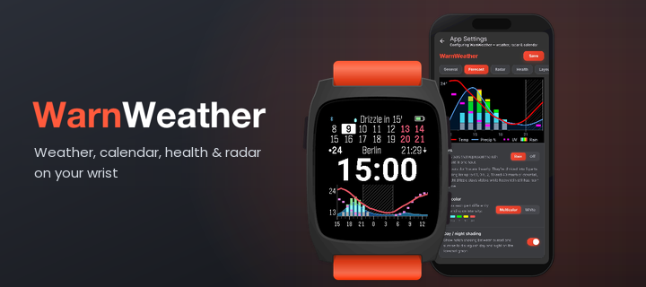
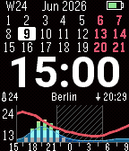
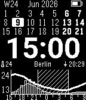
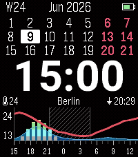

  

A weather watchface for Pebble inspired by ForecasWatch2, with a 24-hour forecast, a 3-week calendar, health tracking, and rain radar.

## Screenshots

| Pebble Time                                                                                       | Pebble 2 Duo                                                                                       | Pebble Time 2                                                                                      |
|---------------------------------------------------------------------------------------------------|----------------------------------------------------------------------------------------------------|----------------------------------------------------------------------------------------------------|
|  |  |  |

## Features

**Alerts** *(not on Pebble Classic/Steel)*\
Small screens fill up fast. Alerts keep the watchface clean and bring information up only when it matters, so you know before it gets dangerous.
* Alert icons at a status bar's edge, next to the status slot there, that show only when they reach their warn level or are active right now (low battery, Bluetooth disconnected, rain coming, a high UV or wind forecast), and stay hidden the rest of the time. The *Alerts* tab lists them. Open one to set it up and to choose which status bars show it, Left or Right (one side per bar). The Status bars tab shows, under each bar's *Alerts*, the icons placed there. The items and how they show:
  * System info — the watch battery at or below a warn level you set (the icon, or the icon and the charge), Bluetooth when it disconnects (or connects, or both), quiet time while it is on, and a sleep icon during the Battery saver hours
  * Weather alerts — rain falling or on its way, or wind gusts, UV index, air quality, pollen (with DWD) or wind speed reaching your warn level today (later hours included) or, once nothing left today does, tomorrow; each metric alert can print its value next to its icon and can stick to today or also look ahead to tomorrow, marking a tomorrow alert with `»` or a mark you pick (`>`, `+`, `*` or none); the rain alert shows as the rain icon, the minutes until it starts (or, while it rains, how long it keeps falling), or the full countdown text
  * On by default: Bluetooth, quiet time, sleep and the rain alert on the left of the Watch Status Bar (the top bar), and the battery with the wind gust, UV index, air quality and wind speed alerts on its right; the pollen alert is off, and every other bar starts with no alerts
  * The battery item stays out while a slot of the same bar already shows the watch battery, and stands in once that slot has to hide
  * A weather alert (UV index, wind speed, wind gusts, air quality, pollen) on the side whose status slot shows the same value goes into that slot: the slot shows its own value and the alert's once (`3/8`, `4/»9`) in the alert's colors, and the alert icon shows only once that slot has to hide
  * When a bar runs short of room, its slots switch to short forms — a four-digit year to `'26` (`26` after a dot or slash), a city abbreviating its shorter words (`N. York`, `Frankfurt a. M.`) and then cut with `…`, sleep to `7h`, steps to `12k`, units and spaces dropped (`12°` → `12`, `12 / 30kph` → `12/30`) — then the slot beside the items hides, then the middle slot leaves the centre and hides, and only then do the alert values and the rain text shorten, and last the lowest-priority items drop; the date shortens no further than its year, and a battery number, sunrise/sunset and the calendar week never shorten: they show whole or hide
* Alert levels: a warn and a danger level for each weather alert (wind gusts, UV index, air quality, pollen, wind speed), set in its dialog on the *Alerts* tab, with its own colors on color watches
* Alert highlighting: bold, outline, or fill a status slot when a metric reaches the warn or danger level you set (its Alert levels)
* Graph lines on Alert (Visible values: All | Alert): a wind speed, wind gust or UV index line draws every value, or only where it reaches your warn level (its Alert levels), its scale then starting at that level, so the small graph stays empty until it matters (Graphs tab › Forecast, in the metric's dialog)

**Forecast**
* 24-hour forecast with a temperature line and configurable, battery-friendly updates (on Pebble Time 2: 12, 24 or 48 hours, Graphs tab › Forecast › Time span)
* Configurable metrics such as precipitation, cloud cover, UV index, gusts, wind, air pressure, feels-like temperature and dew point (both drawn on the temperature scale)
* Up to four metric lines at once, each in its own style — thin or thick line, square dots, little x marks, or (for precipitation, cloud cover, UV, wind and gusts) a shaded stripe along the top of the graph or below its zero line, whose colour strengthens with the value (third and fourth metric and style selection on watches with enough memory, not Pebble Classic/Steel)
* Draw from: Bottom | Top: the precipitation, cloud cover, wind, gust and UV index lines, and with *Bars from* the rain bars of the forecast and of the radar graph, can hang from the top of the graph instead of standing on its bottom, a bigger value reaching further down, so they cover the temperature curve less (wind and gusts move together, and a main metric's area fill hangs with its line; not on Pebble Classic/Steel)
* Optional day/night shading
* Recolor the forecast graph per metric
* Multiple weather providers, including regional and worldwide sources

**Rain radar**
* 2-hour precipitation nowcast from regional and worldwide providers
* Worldwide Rainbow.ai radar out of the box — *Rainbow (limited)* in the radar picker: shared by every user, so it refreshes every 30 minutes; pick *Rainbow (own key)* and add your own Rainbow API key to refresh it at your update interval (free for 5,000 calls a month; Rainbow asks for a credit card)
* The radar says *Radar limit reached* when a radar source refuses requests over its limit, instead of claiming no rain
* Outside a regional radar's area (DWD: Germany, Met.no: the Nordic countries) the radar says so, and the radar settings (Graphs tab › Rain radar) suggest a source that covers your location
* Rain alert telling you when rain starts (or stops), at a status bar's edge while rain is on its way (see **Alerts** above)
* Choose how much radar you see — Off, the rain alert only, a radar status line, or the full radar graph — under Watchface › Views
* Clouds, sun & lightning rows under the radar graph's time axis (on by default): cloud cover and sun strength per quarter hour for the next 2 hours, with a lightning bolt where thunderstorms are expected (Open-Meteo, any radar source; not on Pebble Classic/Steel, which has no radar)

**Health view** *(requires a health-capable watch; heart rate needs a heart-rate sensor)*
* Health status for steps, sleep, distance, and heart rate
* Last-24h health chart with steps per hour, heart rate on a scale you set, and a sleep band

**Calendar**
* Multi-week calendar with current-day highlight
* Selectable start of week and customizable highlights for weekends and holidays (150+ countries)

**Status bars**
* Configurable status slots on every view: fill each slot from a catalog of metrics — weather, dew point, air quality, pollen, wind, health, watch battery (glyph or percentage), phone battery, a countdown to any date, and more
* Selectable date format for the date slot — German/European, US, ISO, and spelled-out-month styles, chosen separately for calendar views (month + year) and no-calendar views (full date)
* Bold status values to make them stand out or easier to read (not on Pebble Classic/Steel)
* Goal highlighting: bold, outline, or fill a status slot when it reaches a goal you set (not on Pebble Classic/Steel)
* Alerts at each status bar's edge (see **Alerts** above)

**Watchface themes**
* Dark and Light, plus Black & White options on color watches
* Theme switching: add a night theme, flipped at sunrise/sunset or between hours you set

**Watch**
* Custom color, 12h/24h, optional AM/PM
* Smooth, anti-aliased clock digits on color watches (Roboto and Bitham fonts)
* Battery, Bluetooth, quiet time and sleep indicators that show only when needed, as Alerts you place per status bar (see **Alerts** above), plus vibrate on disconnect (Pebble Classic/Steel keeps its fixed indicators)
* Battery saver (pause updates to the watch between hours you set, to save battery)
* Dim backlight on Pebble Time 2: when the backlight comes on between hours you set it glows a color you pick instead of white — it never switches the backlight on by itself

**Layout customization**
* Multiple layout presets, with flick-to-cycle between views (or a double flick, to reduce accidental view switches) and optional auto-return — including *Weather only*: no top bar, just the rain radar, clock, weather and a big forecast (not on Pebble Classic/Steel)
* Fully custom layouts (not on Pebble Classic/Steel): build each view yourself — pick, remove and reorder the calendar, clock and status bars per view; any view can drop its top bar, and flick views also the clock, for a true full-screen radar or graph
* Light/Dark settings page in six tabs — Weather, Watchface, Status bars, Alerts, Graphs, Setup (no Alerts tab on Pebble Classic/Steel) — with a pinned live preview, an explanation under each setting (or, with *Hide info text* in Setup › Misc, behind a ? you tap), rarely-changed settings under *More options*, and full-screen dialogs (× discards, Done keeps)
* Weather tab in the settings page: live graphs — temperature & precipitation, wind & gusts, humidity & dew point, pressure, sun & moon — plus a 5-day forecast, for your current location or up to three saved places, with its own switchable data source (never touches the watchface's provider or location); refreshes only on demand — pull down or tap Refresh, which also re-reads your phone's location; it leads the tab bar, and a Setup › Misc toggle makes it the tab the page opens on
* First-run setup wizard that picks sensible defaults for your country and watch — it bolds the rows you read first, highlights air quality from its warn level, and puts steps on the top row when your watch has health

*Weather and radar data from [MET Norway](https://www.met.no/) is used under [CC BY 4.0](https://creativecommons.org/licenses/by/4.0/).*

## Forecast graph vs. rain radar

Two things that both involve rain over time, but answer different questions:

- **Forecast graph** — the hourly prediction, looking up to 24 hours ahead (on Pebble Time 2,
  12, 24 or 48 — Time span). Temperature is always shown; on top of it you choose what to
  add — precipitation %, cloud cover % (every
  provider except Yandex), wind speed, wind gusts, UV index, air pressure (sea-level, in hPa,
  with a Narrow/Mid/Wide graph scale), feels-like temperature or dew point (both drawn on the
  same scale as the temperature curve) as a main
  metric, an optional second metric, and — on watches with enough memory (not Pebble
  Classic/Steel) — an optional third and fourth metric (the same metric can't appear twice), plus
  optional bars for the hourly rain amount. Each metric line has a selectable style: thin or thick
  solid line, bar-aligned square dots, little x marks, or — for the intensity metrics
  (precipitation, cloud cover, UV, wind, gusts) — a stripe: a thin band of hourly cells
  along the top of the graph or in its own band below the zero line (where bars and lines never
  cover it), shaded stronger the higher the value (on black & white watches as denser
  dithering) (defaults: line, dots, x, x; style selection is
  likewise not on Pebble Classic/Steel, which keeps the classic line + dots look). The rain
  bars and the precipitation, cloud cover, wind, gust and UV index lines stand on the graph's
  bottom by default; with *Draw from* (under each line's Line style) or *Bars from* (for the
  bars) set to *Top* they hang from the top of the graph instead, below any top stripes,
  so a bigger value reaches further down and they cover the temperature curve less (wind and
  gusts share one setting, and a main metric's area fill hangs with its line; not on Pebble
  Classic/Steel). The
  temperature status slot can also show the feels-like value, or both as `12|10`; the UV index
  slot can show the highest UV left today (Day max), or both as `3/7`; today's peak stays
  while it is still ahead or happening now, then tomorrow's shows instead, marked `»` (`4/»8`),
  or just the current reading when tomorrow's isn't known. Tomorrow's peak never triggers Alert
  highlighting. The wind, gust and air quality slots offer the same Day max (air quality with the
  Open-Meteo AQI provider, whose hourly forecast it needs; WAQI reports the current reading
  only). How the pair is written is up to you: pick the separator (`12|10`, `12/10`, `12(10)`,
  `12·10` or your own), with or without spaces around it (`12 | 10`), which value comes first,
  and how tomorrow's peak is
  marked (`»6`, `>6`, `+6`, `6*` or no mark). Feels-like itself comes in two flavours, picked
  under Setup › Units › *Feels-like formula* (in *More options*): the provider's own value (Tomorrow.io and Weather
  Underground follow the US heat-index/wind-chill rule, so theirs equals the air temperature in
  mild weather; DWD and Met.no publish none) or the Steadman apparent temperature computed from
  temperature, humidity and wind, which reads the same on every provider.
- **Rain radar** — unlike the forecast graph's model prediction, this is a short-term nowcast
  based on actual radar measurements moving toward you, refreshed often as new scans arrive.
  Instead of a map it's drawn as bars: the provider's radar images for the next 2 hours are
  sampled at your location, and each 5-minute frame becomes one bar whose height is the rain
  amount — solid bars are rain at your exact spot; with DWD, the hatched outline behind
  them is the strongest rain within 2 km. The bars stand on the graph's bottom, or hang from
  below its time axis with *Bars from* set to *Top* (Graphs tab › Rain radar), heavier
  rain reaching further down. Available from DWD (Germany), Met.no (Nordics), Rainbow.ai
  (worldwide, exact location only; *Rainbow (limited)* on the shared key refreshes every 30
  minutes, *Rainbow (own key)* on your own Rainbow API key refreshes at your update interval —
  free for 5,000 calls a month, Rainbow asks for a credit card) and Tomorrow.io (worldwide, needs a free API key). Good for *"is it about to rain on me right now?"*
  With *Clouds, sun & lightning* (Graphs tab › Rain radar, on by default), two thin stripes appear under the
  graph's time axis: cloud cover (thin high cloud counts half) and sun strength (full when the
  sun is as strong as under a clear sky) for each quarter hour, drawn like the forecast's
  stripes, with a lightning bolt in the quarter hours where Open-Meteo expects a
  thunderstorm (lightning potential sharpens that in Central Europe).

## Platforms

Pebble Classic, Pebble Steel, Pebble Time, Pebble Time Steel, Pebble 2, Pebble 2 Duo, and Pebble Time 2 are supported.

## Installation

### Pebble Appstore

- RePebble: https://apps.repebble.com/67d6f1fcdb264341b850f79a
- Rebble: https://apps.rebble.io/en_US/application/6a3645239d979d000abc99db

If you're using the modern Pebble app, the RePebble listing should be the simplest install path. If you prefer the Rebble flow, follow https://help.rebble.io/setup to set up your Pebble app first. The RePebble store uses Rebble's backend ([blog](https://ericmigi.com/blog/re-introducing-the-pebble-appstore)), so they're effectively the same catalog through a different entry point.

### Manual install

If you want to sideload a specific build, use the modern Pebble app on [iOS](https://repebble.com/app) or [Android](https://repebble.com/app), which supports installing `.pbw` files directly. Download the latest [`warnweather.pbw`](https://github.com/Toasbi/WarnWeather/releases/latest/download/warnweather.pbw) release and install it with the app.

## Developers

See [CONTRIBUTING.md](CONTRIBUTING.md) for developer setup and workflow.

## Telemetry

WarnWeather includes privacy-respecting telemetry. I do not collect precise location or API keys. Account and watch identifiers are stored only as server-side HMAC hashes—enough for rough usage stats (e.g. DAU), not as readable IDs.

- Collected: each weather fetch’s outcome and duration, provider, coarse country code when available, app and watch metadata, and an allowlist of non-sensitive settings.
- Not collected: coordinates (lat/lon), city/state, manual location strings, your API keys, or any health data — your steps, sleep, and heart-rate readings never leave the watch.
- Purpose: estimate DAU, see coarse country mix, spot weather-fetch failures, and learn which settings are common.
- You may opt-out of telemetry by disabling it in the settings.
